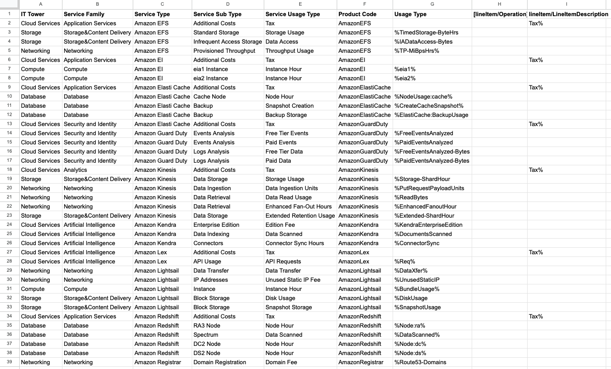

# Лабораторная работа №1 "AWS"
### Вариант 6

### Постановка задачи
Знакомство с облачными сервисами. Понимание уровней абстракции над инфраструктурой в облаке. 
Формирование понимания типов потребления сервисов в сервисной-модели

### Ход работы
Был проанализирован биллинг-файл облачного провайдера Amazon Web Services. 
Основная задача заключалась в сопоставлении каждой строки биллинга с предложенной иерархической моделью:   
`IT Tower → Service Family → Service Type → Service Sub Type → Service Usage Type`  

Сервисы, которые были рассмотрены:
- `AmazonEFS` - облачная служба хранения файлов для приложений и рабочих нагрузок  
- `Amazon EI` - сервис, позволяющий подключать недорогие графические (GPU) ускорители к виртуальным серверам для задач машинного обучения
- `Amazon Elasti Cache` - управляемый сервис кэширования в оперативной памяти для ускорения работы баз данных и приложений
- `Amazon Guard Duty` - интеллектуальный сервис для обнаружения угроз, который непрерывно отслеживает вредоносную активность в облаке
- `Amazon Kinesis` - сервис для сбора, обработки и анализа потоковых данных в реальном времени
- `Amazon Kendra` - сервис поиска на основе ИИ
- `Amazon Lex` - сервис для разработки диалоговых интерфейсов на основе искусственного интеллекта
- `Amazon Lightsail` - облачная платформа для упрощения развертывания и управления виртуальными частными серверами
- `Amazon Redshift` - облачное хранилище данных, предназначенное для анализа больших объёмов данных и выполнения задач бизнес-аналитики
- `Amazon Registrar` - сервис для регистрации доменных имен

Также были выделены основные функциональные категории:
- `Application Services` - общая категория для высокоуровневых сервисов
- `Storage&Content Delivery` - сервисы для хранения файлов и их быстрой доставки пользователям
- `Networking` - сервисы для управления сетевыми ресурсами
- `Compute` - сервисы, предоставляющие вычислительные мощности
- `Database` - управляемые сервисы для хранения и обработки структурированных данных
- `Security and Identity` - сервисы, предназначенные для защиты облачных ресурсов
- `Analytics` - сервисы, предназначенные для обработки, анализа и визуализации больших объемов данных
- `Artificial Intelligence` - сервисы, предоставляющие готовые модели и инструменты для задач искусственного интеллекта и машинного обучения

Далее это было классифицировано на основные подпиты сервиса и на типы потребления сервиса, результат:

В результате исходная таблица с техническими данными была преобразована в структурированный аналитический срез. 
Полученная иерархия позволяет проводить анализ затрат на облачную инфраструктуру, агрегируя расходы от общего уровня
до конкретной единицы тарификации

> Ресурсы, которые пригодились: [офф сайт](https://aws.amazon.com), [самая полезная штука](https://google.com), [ну тут без комментариев](https://translate.yandex.ru/?ysclid=mjkpkkw656642286798)

> Ссылка на гугл табличку [воть](https://docs.google.com/spreadsheets/d/1uLJP9wq6vb_0R-yqe2c2J1GaRe5X2dNRYGkA6THIih4/edit?usp=sharing)
