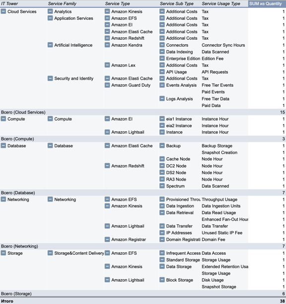

# Лабораторная работа №2 "Analysis"

### Постановка задачи
Постановка задачи

Получение навыков аналитики и понимания спектра публичных облачных сервисов без привязки к вендору.
Сформировать комплексное видение Облака и научиться распределять потребление сервисов по иерархии:
IT Tower → Service Family → Service Type → Service Sub Type → Service Usage Type → Quantity

### Ход работы
Был использован слепок данных биллинга от облачного провайдера после предварительной обработки (SQL-параметры).
Основная задача заключалась в том, чтобы сопоставить каждый Usage Type
с его классификацией по 5 уровням иерархии, продолжая концепию ЛР1

Для каждой строки определены следующие атрибуты:

- IT Tower – категория ресурса (Compute, Storage, Cloud Services, Database, Networking)
- Service Family – категория внутри IT Tower
- Service Type – конкретный сервис
- Service Sub Type – подразделение сервиса по типу задачи
- Service Usage Type – вид потребления (Instance Hour, Storage Usage, API Requests и тд)
- Quantity – единица измерения

### Результаты

Полученная таблица представляет собой структурированный аналитический срез, который позволяет:
- Выполнять анализ данных на уровне IT Tower, Service Family, Service Type, Service Sub Type и Service Usage Type. 
- Построить иерархические визуализации для анализа распределения ресурсов.

> Ресурсы, которые пригодились: [офф сайт](https://aws.amazon.com)

> Ссылка на гугл табличку [гугл](https://docs.google.com/spreadsheets/d/1bGzdHSmLB8tEVwiV0gV9dQ_H6VtuPOxcIPekTm5r0Y4/edit?usp=sharing)
