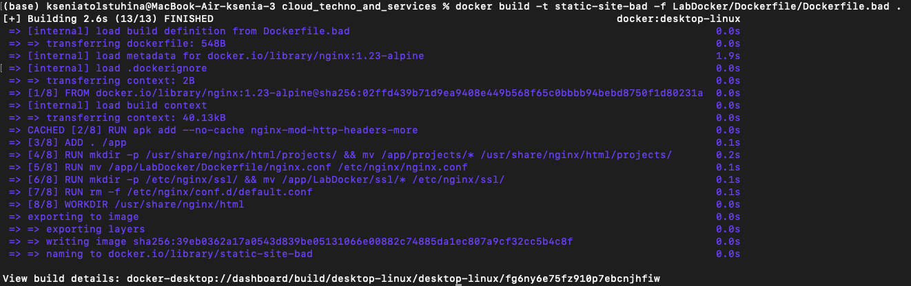
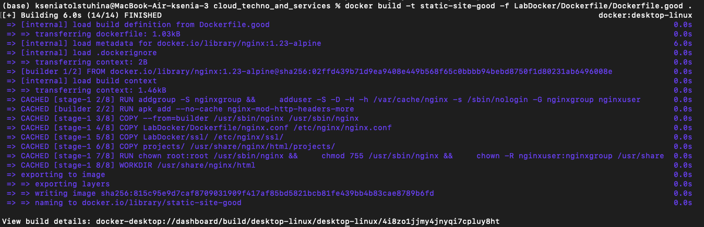
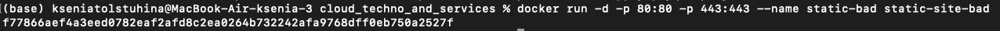
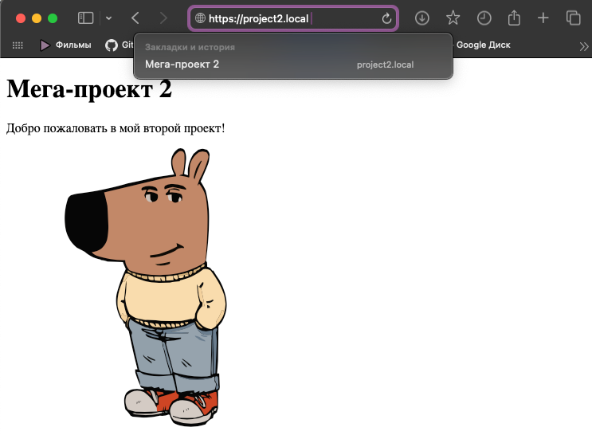
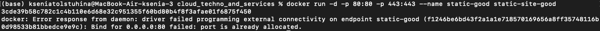
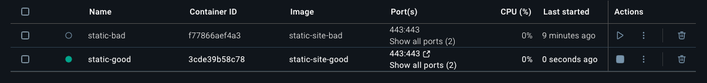
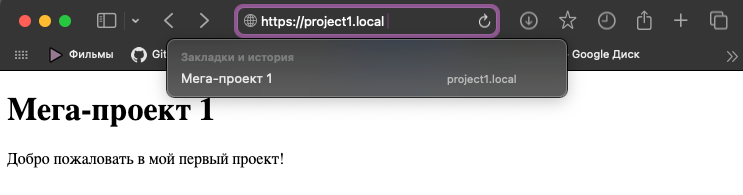

# Отчет по лабораторной работе №2 "Docker"
###  (Или как не превратить свой контейнер в ящик Пандоры)

---

Итак, в лабораторной работе нужно было написать два Dockerfile, один с ```bad practices```, второй с ```best Practices```  

~~Чтобы NGINX'у было с чем работать, пришлось оперативно создавать Мега-пет-проекты [project1](../Projects/project1) и [project2](../Projects/project2)~~   
Для тестирования работы докера были использованы Мега-пет-проекты из папки [projects](../Projects)

## "Плохой" Dockerfile
Тот самый случай, когда фраза ```работает - не трогай``` не работает
```text
FROM nginx:1.23-alpine

RUN apk add --no-cache nginx-mod-http-headers-more

ADD . /app

RUN mkdir -p /usr/share/nginx/html/projects/ && mv /app/projects/* /usr/share/nginx/html/projects/
RUN mv /app/LabDocker/Dockerfile/nginx.conf /etc/nginx/nginx.conf
RUN mkdir -p /etc/nginx/ssl/ && mv /app/LabDocker/ssl/* /etc/nginx/ssl/
RUN rm -f /etc/nginx/conf.d/default.conf

WORKDIR /usr/share/nginx/html

EXPOSE 80 443 8080 9000

CMD ["nginx", "-g", "daemon off; pid /tmp/nginx.pid;"]
```

## "Хороший" Dockerfile

```text
FROM nginx:1.23-alpine AS builder
RUN apk add --no-cache nginx-mod-http-headers-more

FROM nginx:1.23-alpine

RUN addgroup -S nerootgroup && \
    adduser -S -D -H -h /var/cache/nginx -s /sbin/nologin -G nerootgroup neroot

COPY --from=builder /usr/sbin/nginx /usr/sbin/nginx

COPY LabDocker/Dockerfile/nginx.conf /etc/nginx/nginx.conf
COPY LabDocker/ssl/ /etc/nginx/ssl/
COPY projects/ /usr/share/nginx/html/projects/

RUN chown root:root /usr/sbin/nginx && \
    chmod 755 /usr/sbin/nginx && \
    chown -R neroot:nerootgroup /usr/share/nginx/html /var/cache/nginx && \
    chmod 644 /etc/nginx/nginx.conf && \
    chmod 644 /etc/nginx/ssl/cert.key && \
    chmod 644 /etc/nginx/ssl/cert.pem && \
    mkdir -p /var/run/nginx && \
    chown neroot:nerootgroup /var/run/nginx && \
    rm -f /etc/nginx/conf.d/default.conf

WORKDIR /usr/share/nginx/html

EXPOSE 80 443

USER neroot

CMD ["nginx", "-g", "daemon off; pid /tmp/nginx.pid;"]
```

## Разбор полетов: что не так у "плохого" и почему?

### Многоступенчатая сборка (Multi-stage builds)
Отсутствие многоступенчатой сборки похоже на "все свое ношу с собой"  
Инструкция (из "плохого" докера):
```text
RUN apk add --no-cache nginx-mod-http-headers-more
```
устанавливает необходимый модуль, но вместе с ним в финальном образе остаются сам пакетный 
менеджер ```apk```, кэши, временные файлы и другие зависимости, которые нужны только  на этапе сборки  

**Почему это больно?**
- Размер образа становится больше -> загрузка медленнее/занимает больше места на диске/```...```
- Каждая лишняя утилита в образе - потенциальная дверь для хакеров/злоумышленников (ну или просто студентов у которых задача взломать nginx).

**Как это было исправлено в "хорошем" докере?**  
Присутствием ```Multi-stage builds``` :)

```text
FROM nginx:1.23-alpine AS builder

RUN apk add --no-cache nginx-mod-http-headers-more

FROM nginx:1.23-alpine
```
На первом этапе ```FROM nginx:1.23-alpine AS builder``` мы создаем временный
контейнер, в котором устанавливается модуль  
Второй, финальный этап ```FROM nginx:1.23-alpine``` - это уже чистый образ, в который
мы с помощью ```COPY --from=builder``` копируем только необходимый результат
работы первого этапа (в нашем случае - Nginx)  

**В результате**
- Отстутсвуют ненужные файлы -> Образ становится меньше по размеру
- Dockerfile становится декларативным и легко читаемым
- Кэширование сборки работает более эффективно


### Неэффективная работа с файлами и лишние слои
**Что плохого в "плохом" Dockerfile?**  
1) ```ADD . /app``` - эта инструкция без разбора копирует весь контекст сборки 
(включая .git, временные файлы IDE, другие Dockerfile, фотки кота, мемы, ```...```) внутрь образа.
2) ```RUN ... && mv ...``` - перемещаем файлы из временной папки в нужные места(еще и присутствует необходимость создавать папки ручками ```mkdir ...```)
3) Куча слоев: инструкция ```RUN``` создает новый слой в образе

**Почему это плохо?**

- Это неэффективно и небезопасно, так как образ включает дополнительно то, 
что не должно быть включено 
- Лишние слои увеличивают итоговый размер образа 
- Плохая читаемость: логика ```сначала навалим все в одну кучу, потом разберемся```
сложнее для понимания, чем прямое копирование в место назначения 
- Проблемы с кэшированием: ```ADD .``` ломает кэш сборки при любом изменении любого файла в проекте, даже не относящегося к образу

**Как это исправлено в "хорошем" Dockerfile?**
1) Используются точные инструкции ```COPY``` для каждого необходимого ресурса и сразу в финальное местоположение:
```text
COPY LabDocker/Dockerfile/nginx.conf /etc/nginx/nginx.conf
COPY LabDocker/ssl/ /etc/nginx/ssl/
COPY projects/ /usr/share/nginx/html/projects/
```
а также используется [.dockerignore](../LabDocker/.dockerignore)
2) Все команды по настройке прав и удалению файлов объединены в одну инструкцию 
```RUN``` с помощью ```&&```. Это создает всего один слой для всех этих операций:
```text
RUN chown root:root /usr/sbin/nginx && \
    chmod 755 /usr/sbin/nginx && \
    chown -R neroot:nerootgroup /usr/share/nginx/html /var/cache/nginx && \
    chmod 644 /etc/nginx/nginx.conf && \
    chmod 644 /etc/nginx/ssl/cert.key && \
    chmod 644 /etc/nginx/ssl/cert.pem && \
    mkdir -p /var/run/nginx && \
    chown neroot:nerootgroup /var/run/nginx && \
    rm -f /etc/nginx/conf.d/default.conf
```

**Таким образом**
- Образ становится меньше по размеру за счет меньшего количества слоев и отсутствия "мусора"
- Dockerfile становится декларативным и легко читаемым
- Кэширование сборки работает более эффективно
- БОНУС: ```COPY``` сам создаёт родительские директории — ```mkdir``` не нужен


### Выполнение процесса от имени root-пользователя

В "плохом" Dockerfile отсутствует инструкция USER, поэтому все команды сборки и, что самое важное, основной процесс Nginx (CMD) запускаются от имени суперпользователя root

**Почему это плохо?**  
Это не просто плохо, это ```катастрофа``` с точки зрения безопасности. 
Если злоумышленник найдет способ эксплуатировать уязвимость в Nginx или 
в нашем веб-приложении, он получит полный root-доступ внутри контейнера. 
Это позволит ему устанавливать вредоносное ПО, читать любые файлы, атаковать другие контейнеры, 
а оттуда уже рукой подать до захвата ~~всего мира~~ всей системы. ```Game over```

**Как это исправлено в "хорошем" Dockerfile?**

1) С помощью ```addgroup``` и ```adduser``` создается специальный системный пользователь ```neroot``` с ограниченными правами
```text
RUN addgroup -S nerootgroup && \
    adduser -S -D -H -h /var/cache/nginx -s /sbin/nologin -G nerootgroup neroot
```
2) Также нет привязки к определенному ```UID``` (система сама назначит нужный) -> контейнер будет работать с любым ```UID```
3) С помощью ```chown``` выдаем пользователю права только на те директории, с которыми ему необходимо работать
4) С помощью ```chmod``` выдаем права доступа к фалам 
5) Используем инструкцию ```USER neroot```, которая переключает контекст выполнения

**Таким образом**  
Исполняемые файлы и конфигурации остаются принадлежать ```root``` для защиты от модификации,
а у пользователя права доступа только к тому, что ему нужно для работы

## Запуск
Для "плохого" Dockerfile  


Для хорошего DockerFile  


Теперь запускаем "плохой":  
  
Появился:  
  
Открывается:  


Теперь запускаем "хороший":  
  

Ругается:( Порт благополучно занял плохой докер, стопанем его пожалуй 
Теперь все работает:  


В целом оно работает точно также, поэтому просто открою другую страничку:  
  


## Плохие практики при работе с контейнерами
**1) Хранить данные в контейнерах**  
Почему?  
Контейнер может быть остановлен, удален или заменен в любой момент,
поэтому хранить там данные не рационально, лучше делать это где-нибудь на диске/хранилище/```...```

**2) Передача паролей(или еще чего нибудь важного) через переменные окружения**  
Существует небезопасный способ передать в контейнер пароль от базы данных или API-ключ — это использовать флаг ```-e``` (```--env```)  
**Почему это плохо?**  
Практически любой может выполнить команду ```docker inspect``` и увидеть все переменные окружения, включая пароли, ключи, ```...```, в открытом текстовом виде  
Также они могут быть случайно раскрыты в логах или в системах мониторинга  
**Пример плохого запуска:**  
```text
docker run --name some-app -d \
       -e DB_USER=admin \
       -e DB_PASSWORD="MySuperSecretPassword123" \
       my-app-image
```
Лучше использовать что-то типа:
- Docker Secrets
- Kubernetes Secrets
- Внешние хранилища


### Мини команды, которые оказались полезными
Парочка простых, но полезных команд, которые помогли не сойти с ума, когда докер просто "игнорил" и не выводил логи сам
```text
docker ps -a  # Показывает все контейнеры (работающие и остановленные)
```
```text
docker logs <id контейнера> # выводит логи конкретного контейнера
```
```text
docker build --no-cache --progress=plain  <...>  # Собирает образ заново без кеша и показывает детальный прогресс сборки
```
