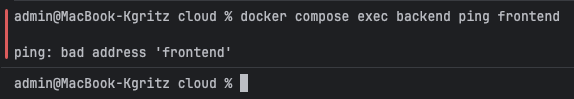
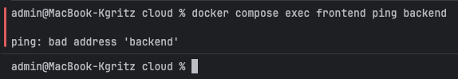

## Отчет по лабораторной работе №2 "Docker"

В рамках данной лабораторной нужно написать 2 файла docker-compose.yml
с использованием плохих и хороших практик соответсвенно.

Для выполнения обратимся к **реальному кейсу**.
Этой осенью проходил совместный хакатон **ИТМО и ЯндексОбразования по ML**,
для проведения которого нужна была платформа.

Возьмем docker-compose использованный там и попробуем улучшить его, где возможно, и сделать **bad** версию.

### Оригинальный docker-compose
```
services:
  backend:
    build:
      context: ./backend
      dockerfile: Dockerfile
    container_name: backend
    environment:
      - DATABASE_URL=sqlite:///./hackathon.db
    expose:
      - "8000"
    networks:
      - default
    volumes:
      - ./backend/files:/app/files
    command: uvicorn main:app --host 0.0.0.0 --port 8000

  frontend:
    build:
      context: ./frontend
      dockerfile: Dockerfile
    container_name: frontend
    restart: unless-stopped
    ports:
      - "443:443"
      - "80:80"
    depends_on:
      - backend
    networks:
      - default

volumes:
  backend_data: {}
```

### Плохой docker-compose

Ниже приведен compose файл, в котором намеренно допущены несколько bad practices.

```
services:
  backend:
    build:
      context: ./backend
      dockerfile: Dockerfile
    container_name: backend
    restart: always    # перезапуск без доп условий
    environment:
      - DATABASE_URL=sqlite:///./hackathon.db
      - SECRET_KEY=admin    # env прописал прямо тут
    ports:
      - "8000:8000"    # бэк открыт в сеть
    networks:
      - default    # отстутствует изоляция
    volumes:
      - ./backend:/app    # монтируем весь код
      - ./backend/files:/app/files
    command: uvicorn main:app --host 0.0.0.0 --port 8000

  frontend:
    build:
      context: ./frontend
      dockerfile: Dockerfile
    container_name: frontend
    restart: always    # перезапуск без доп условий x2
    ports:
      - "443:443"
      - "80:80"
    volumes:
      - ./frontend:/usr/share/nginx/html    # весь фронт вмонтирован
    depends_on:
      - backend
    networks:
      - default    # отстутствует изоляция x2
```

### Разбор плохих практик

1. Перезапуск контейнеров
``restart: always``

Контейнер перезапускается даже при ручной остановке

Правильно: 
``unless-stopped``

2. Хранение секретов прямо в environment
   ``SECRET_KEY=admin``

Это загружается на git, становится видно всем в репе, поэтому правильно было бы использовать .env, secret-manager или CI-переменные

3. Проброс backend наружу
   ``8000:8000``

Backend становится доступен из интернета

4. Монтирование всего кода хоста
   ```./backend:/app```


Среда перестает быть воспроизводимой и случайные правки могут ломать работу контейнера
Правильно было бы использовать только **data-volume**

5. Отсутствие изоляции

```
networks:
    - default
```

Оба сервиса в default и они автоматически видят друг друга. Это не особо критично в мелких проектах, особенно когда у нас только api и фронт, но нарушается принцип минимума привилегий и придется менять при добавлении новых контейнеров или изменения backend

### Хороший docker-compose
```
services:
  backend:
    build:
      context: ./backend
      dockerfile: Dockerfile
    container_name: backend
    restart: unless-stopped    # перезапуск только при падении
    environment:
      - DATABASE_URL=sqlite:///./hackathon.db
    env_file:
      - .env  # убран env ключ из environment (SECRET_KEY=admin)
    expose:
      - "8000"    # доступ только внутри сети
    volumes:
      - backend_data:/app/files    # только данные, код не монтируется
    networks:
      - backend_net    # отдельная сеть для изоляции
    command: uvicorn main:app --host 0.0.0.0 --port 8000

  frontend:
    build:
      context: ./frontend
      dockerfile: Dockerfile
    container_name: frontend
    restart: unless-stopped    # перезапуск только при падении x2
    ports:
      - "443:443"
      - "80:80"
    depends_on:
      - backend
    networks:
      - frontend_net    # отдельная сеть для изоляции x2

volumes:
  backend_data: {}

networks:    # Мост
  backend_net:
    driver: bridge
  frontend_net:
    driver: bridge
```

### Исправления

| Проблема            | bad                   | good                 | Зачем?                                       |
|---------------------|-----------------------|----------------------|----------------------------------------------|
| Условия перезапуска | `always`              | `unless-stopped`     | проще администрировать                       |
| Env                 | вписан в compose      | вынесен в `.env`     | безопасность                                 |
| Back доступен из сети | `ports`               | `expose`             | back закрыт из инета, но доступен в своей сети |
| app       | папка app вшивает код | только данные выносятся | воспроизводимость                            |
| Сети                | одна общая default    | две отдельные  | изоляция                                     |


## Изоляция

*После предыдущих пунктов в хорошем файле настроить сервисы так,
чтобы контейнеры в рамках этого compose-проекта так же поднимались вместе,
но не "видели" друг друга по сети.
В отчете описать, как этого добились и кратко объяснить принцип такой изоляции*

В хорошем варианте настроены две отдельные bridge-сети:

```
backend: 
    networks:
        - backend_net    # отдельная сеть для изоляции
```

```
frontend: 
    networks:
        - frontend_net   # отдельная сеть для изоляции x2
```


```
networks:
  backend_net:
    driver: bridge
  frontend_net:
    driver: bridge
```

Backend и Frontend находятся в разных сетях.
Это означает у каждого свое пространство, свои маршруты, dns и тп.

Это удобно, при настройке взаимосвязей если есть куча контейнеров и не всем нужно иметь доступ к каждому из них.
Мы минимизируем привелегии, сокращая шанс на ошибку и уязвимость.

Чтобы проверить соединение попробуем ввести внутри 1 из контейнеров:
```
docker compose exec frontend ping backend
```
```
docker compose exec backend ping frontend
```





Как мы видим контейнеры изолированы и напрямую подключиться друг к другу не могут.