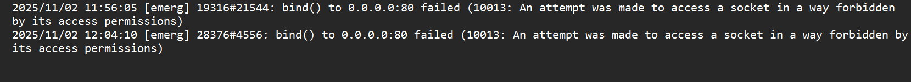
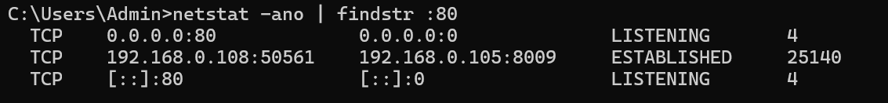
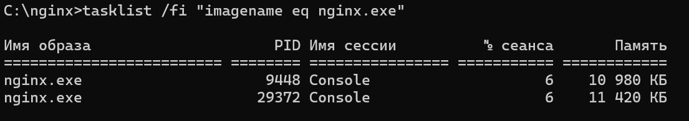
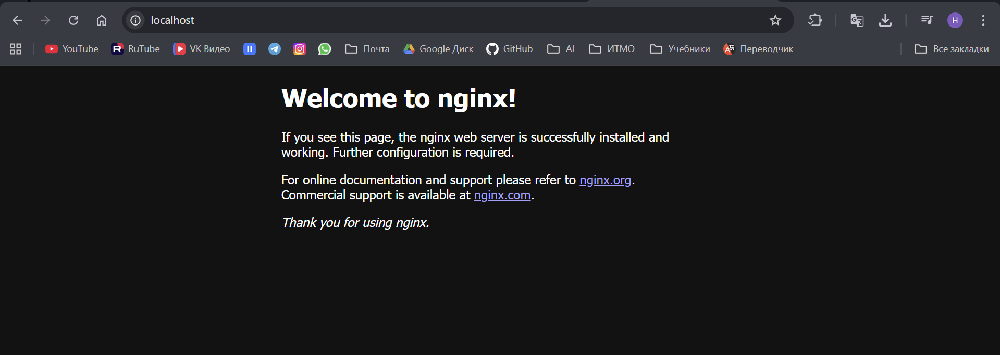
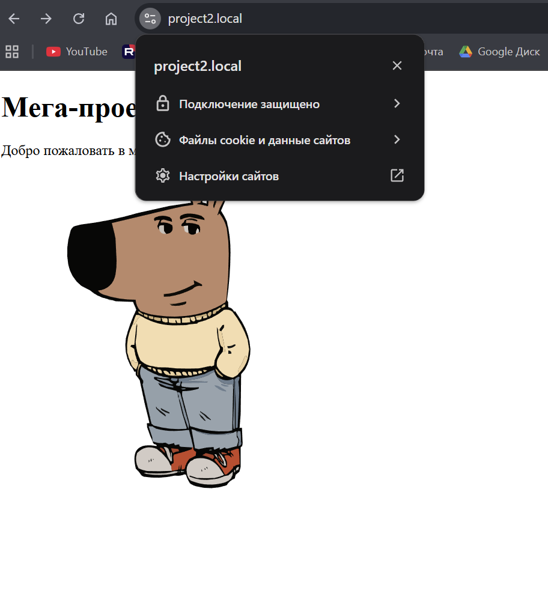

## Отчет по лабораторной работе №1 "NGINX"

### Первый запуск 

В ходе выполнения лабы, как это ни удивительно, был скачан NGINX.
Несмотря на советы индуса из видео, при первом запуске пришлось проверять логи.

Как выяснилось, порт 80 уже слушал какой-то `PID = 4` (системный процесс с ID = 4), и NGINX никак не мог его вытеснить.

Этим PID'ом оказался IISExpress, и, к сожалению, пришлось его ненадолго вырубить. 
После чего жизнь стала счастливее, когда терминал подтвердил, что NGINX начал работу, и при обращении к `localhost` 
в браузере отобразился стандартный экран его приветствия.



### Создание проектов

Чтобы NGINX'у было с чем работать, пришлось оперативно создавать 
Мега-пет-проекты [project1](../projects/project1) и [project2](../projects/project2)

Структура `project1` – простой статический сайт:
```
project1/ 
└── Index.html
```

Структура `project2` – проект с разделённой структурой: HTML-шаблоны и статические ресурсы:
```
project2/
├── wwwroot/
│   ├── images/
│   │   └── ChillGuy.svg
│   └── js/
│       └── script.js
└── Index.html
```

### Конфигурация виртуальных хостов
В файле [nginx.conf](nginx/conf/nginx.conf) были созданы 3 server-блока:
 - два для виртуальных хостов локальных проектов (`project1.local` и `project2.local`)
 - один для обработки запросов к домену `localhost` 
(захотелось по этому адресу иметь страничку со ссылками на другие проекты, чтобы много не тыкать по клавиатуре)

В файл `C:\Windows\System32\drivers\etc\hosts` были добавлены строчки...
```
127.0.0.1 project1.local  
127.0.0.1 project2.local
```
...чтобы браузер понимал, что когда он видит адрес `project1.local` или `project2.local` 
нужно обращаться к локальному серверу (по IP `127.0.0.1`), а не дергать DNS

Получился такой конфиг:
```
worker_processes  1;

events {
    worker_connections  1024;
}

http {
    include       mime.types;
    default_type  application/octet-stream;

    sendfile        on;

    keepalive_timeout  65;

    server {
        listen       80;
        server_name  project1.local;

        location / {
            root   C:/~~~/CloudTechnoAndServices/projects/project1;
            index  index.html;
        }
    }
    
    server {
        listen       80;
        server_name  project2.local;

        location / {
            root   C:/~~~/CloudTechnoAndServices/projects/project2;
            index  index.html;
        }
    }
    
    server {
        listen       80;
        server_name  localhost;

        location / {
            root   C:/~~~/CloudTechnoAndServices/projects/landing;
            index  ChooseProject.html;
        }
    }
}
```

### Настройка alias
Дальше захотелось поработать с наиболее интересным мега-проектом – вторым

Было решено скрыть папку [wwwroot](../projects/project2/wwwroot), а именно – сделать так, чтобы:
 - статические файлы (изображения, скрипты) были доступны по чистым URL-путям 
(`/images/`, `/js/` вместо `/wwwroot/images/`, `/wwwroot/js/`)
 - прямой доступ к служебной директории `wwwroot` (например, по пути `/wwwroot/images/`) 
был полностью заблокирован

Для этого в конфигурации NGINX использована директива `alias`, а также добавлено правило 
с регулярным выражением, возвращающее ошибку `404` при любых попытках обратиться к `/wwwroot` напрямую:
```
server {
    listen       80;
    server_name  project2.local;

    location / {
        root   C:/~~~/CloudTechnoAndServices/projects/project2;
        index  index.html;
    }

    location /images/ {
        alias  C:/~~~/CloudTechnoAndServices/projects/project2/wwwroot/images/;
    }

    location /js/ {
        alias  C:/~~~/CloudTechnoAndServices/projects/project2/wwwroot/js/;
    }

    location ~ ^/wwwroot(/|$) {
        deny all;
        return 404;
    }
}
```

### Настройка защищенного соединения (https)
С помощью `OpenSSL` были созданы (и перемещены в [папку](nginx/ssl)) два файла:
 - приватный ключ (`cert.key`) – секретный файл, который хранится на сервере и используется для расшифровки входящих данных
 - публичный сертификат (`cert.pem`) – файл, который сервер отправляет клиенту (браузеру) для подтверждения своей 
подлинности и для шифрования данных, отправляемых на сервер

В конфиге NGINX: 
 - каждый виртуальный хост (`project1.local`, `project2.local` и `localhost`) стал 
прослушивать порт `443` с директивой `ssl`
 - внутри каждого такого блока были добавлены директивы (`ssl_certificate` и `ssl_certificate_key`), 
которые подключают сгенерированные файлы к серверу
 - настроено принудительное перенаправление http → https

```
worker_processes  1;

events {
    worker_connections  1024;
}

http {
    include       mime.types;
    default_type  application/octet-stream;

    sendfile        on;

    keepalive_timeout  65;

    server {
        listen       80 default_server;
        server_name _;
        return 301 https://$host$request_uri;
    }

    server {
        listen       443 ssl;
        server_name  project1.local;

        ssl_certificate      C:/~~~/CloudTechnoAndServices/LabNginx/nginx/conf/ssl/cert.pem;
        ssl_certificate_key  C:/~~~/CloudTechnoAndServices/LabNginx/nginx/conf/ssl/cert.key;

        location / {
            root   C:/~~~/CloudTechnoAndServices/projects/project1;
            index  index.html;
        }
    }
    
    server {
        listen       443 ssl;
        server_name  project2.local;

        ssl_certificate      C:/~~~/CloudTechnoAndServices/LabNginx/nginx/conf/ssl/cert.pem;
        ssl_certificate_key  C:/~~~/CloudTechnoAndServices/LabNginx/nginx/conf/ssl/cert.key;

        location / {
            root   C:/~~~/CloudTechnoAndServices/projects/project2;
            index  index.html;
        }

        location /images/ {
            alias  C:/~~~/CloudTechnoAndServices/projects/project2/wwwroot/images/;
        }

        location /js/ {
            alias  C:/~~~/CloudTechnoAndServices/projects/project2/wwwroot/js/;
        }

        location ~ ^/wwwroot(/|$) {
            deny all;
            return 404;
        }
    }
    
    server {
        listen       443 ssl;
        server_name  localhost;

        ssl_certificate      C:/~~~/CloudTechnoAndServices/LabNginx/nginx/conf/ssl/cert.pem;
        ssl_certificate_key  C:/~~~/CloudTechnoAndServices/LabNginx/nginx/conf/ssl/cert.key;

        location / {
            root   C:/~~~/CloudTechnoAndServices/projects/landing;
            index  ChooseProject.html;
        }
    }
}
```



### Относительные пути
Чет захотелось поменять абсолютные пути в конфиге на относительные (чтобы закинуть все на GitHub), а также
блокировать особо наглые запросы, содержащие `../` в URI. Получилось то, что получилось:

```
worker_processes  1;

events {
    worker_connections  1024;
}

http {
    include       mime.types;
    default_type  application/octet-stream;

    sendfile        on;

    keepalive_timeout  65;

    location ~ \.\. {
        deny all;
    }

    server {
        listen       80 default_server;
        server_name _;
        return 301 https://$host$request_uri;
    }

    server {
        listen       443 ssl;
        server_name  project1.local;

        ssl_certificate      ../ssl/cert.pem;
        ssl_certificate_key  ../ssl/cert.key;

        location / {
            root   ../../projects/project1;
            index  index.html;
        }
    }
    
    server {
        listen       443 ssl;
        server_name  project2.local;

        ssl_certificate      ../ssl/cert.pem;
        ssl_certificate_key  ../ssl/cert.key;

        location / {
            root   ../../projects/project2;
            index  index.html;
        }

        location /images/ {
            alias  ../../projects/project2/wwwroot/images/;
        }

        location /js/ {
            alias  ../../projects/project2/wwwroot/js/;
        }

        location ~ ^/wwwroot(/|$) {
            deny all;
            return 404;
        }
    }

    server {
        listen       443 ssl;
        server_name  localhost;

        ssl_certificate      ../ssl/cert.pem;
        ssl_certificate_key  ../ssl/cert.key;

        location / {
            root   ../../projects/landing;
            index  ChooseProject.html;
        }
    }
}
```
