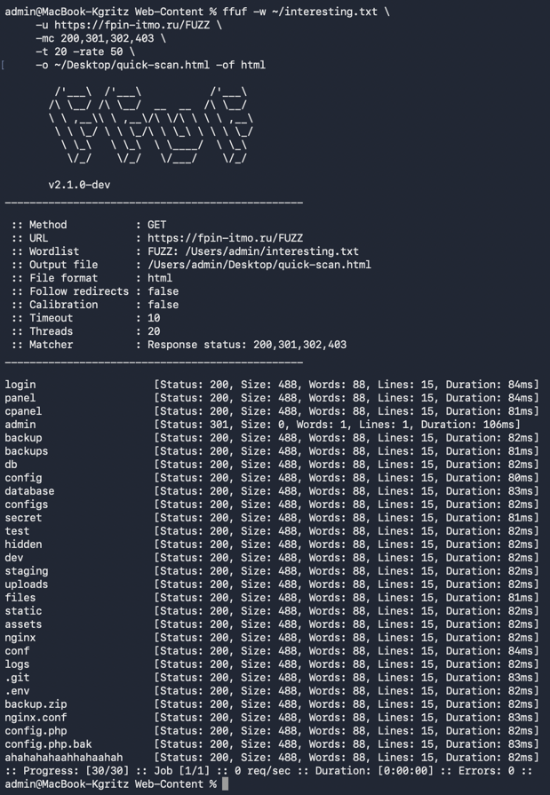
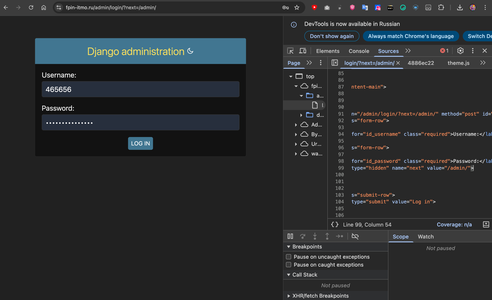
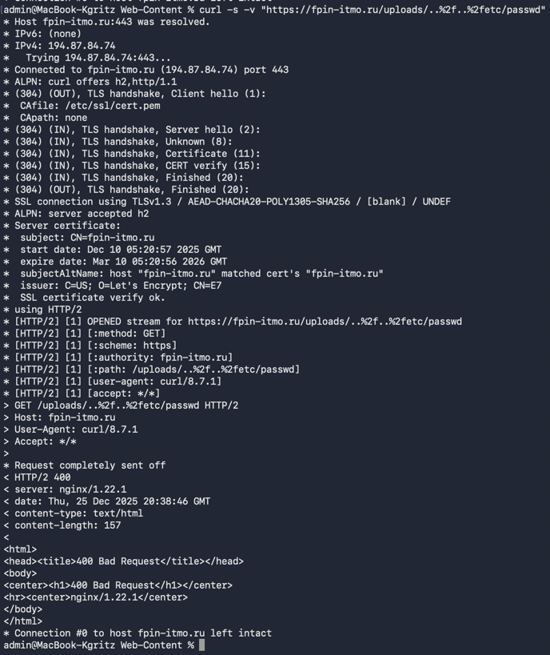
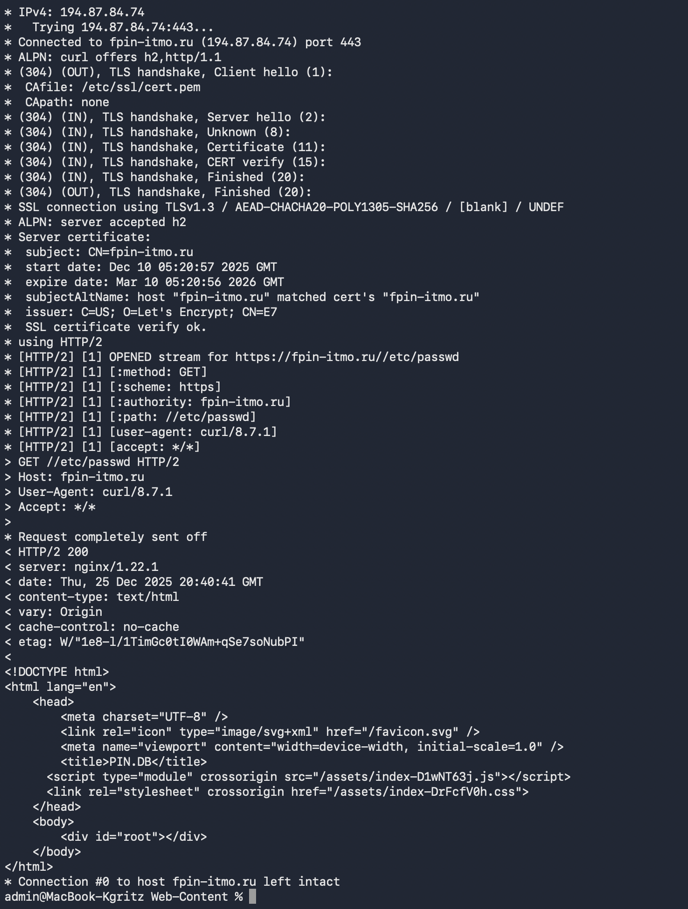
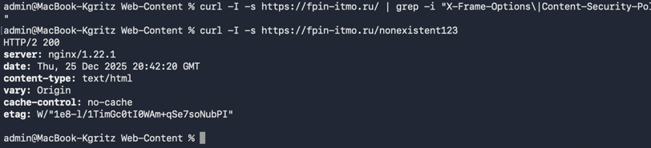

## Отчет по лабораторной работе №1 "NGINX" со Звездочкой*

### Начало

В ходе выполнения лабы я обращался к сайту
для дисциплины "Проектирование и реализация баз данных" по адресу [fpin-itmo.ru](https://fpin-itmo.ru/)

### Directory enumeration with ffuf

ffuf - инструмент для брутфорс перебора страниц.
Чтобы не мучать сервер и не перебирать в течении часа страницы,
было принято решение отказаться от поиска через списки
из [данного репозитория](https://github.com/danielmiessler/SecLists)

Мною был создан [мини-файлик](files/intresting.txt)
```
admin
administrator
login
panel
cpanel
backup
backups
db
database
config
configs
secret
hidden
test
dev
staging
uploads
files
static
assets
nginx
conf
logs
.git
.env
backup.zip
nginx.conf
config.php
config.php.bak
ahahahahaahhahaahah
```

Поиск по нему выдал интересный результат:



Админка действительно была найдена - это редирект на django-панель.



Для остальных же используется заглушка, причем даже для несуществующих ("ahahahahaahhahaahah" - последняя строка)
Это мы можем также понять по 1 колву строк и 1 и тому же размеру файла

```
<!DOCTYPE html>
<html lang="en">
    <head>
        <meta charset="UTF-8" />
        <link rel="icon" type="image/svg+xml" href="/favicon.svg" />
        <meta name="viewport" content="width=device-width, initial-scale=1.0" />
        <title>PIN.DB</title>
      <script type="module" crossorigin src="/assets/index-D1wNT63j.js"></script>
      <link rel="stylesheet" crossorigin href="/assets/index-DrFcfV0h.css">
    </head>
    <body>
        <div id="root"></div>
    </body>
</html>
```

### Path Traversal

Это уязвимость Nginx для обхода каталогов,
когда из-за ошибок в location + alias можно выйти за пределы корневой директории
и прочитать системные файлы (типо /etc/passwd, nginx.conf).

Результаты:

На всех попытках сервер возвращает ту же заглушку 200,

**НО!** Если использовать энкодинг
````
curl -s -v "https://fpin-itmo.ru/uploads/..%2f..%2fetc/passwd"
````

То мы видим 400 запрос, а не 200))



В других путях и без энкодинга или с двойным энкодингом - все тот же 200



### HTTP Security Headers 

Для проверки наличия защитных HTTP-заголовков использовал команду:
```
curl -I -s https://fpin-itmo.ru/ | grep -i "X-Frame-Options\|Content-Security-Policy\|X-Content-Type-Options\|Strict-Transport-Security\|Referrer-Policy\|Permissions-Policy"
```

Результат - полное отсутствие вывода



Это означает, что на сайте нет HSTS заголовка, но сертификат установлен, в итоге сайт уязвим для downgrade-атак

+ как видно на скрине, у нас видно версию сервера nginx, что тоже снижает уровень безопасности